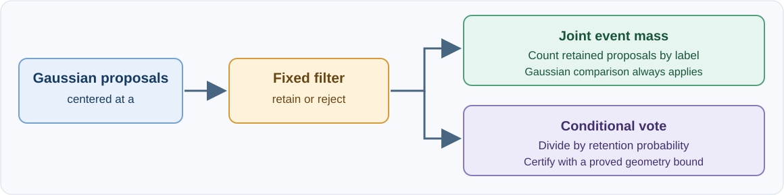
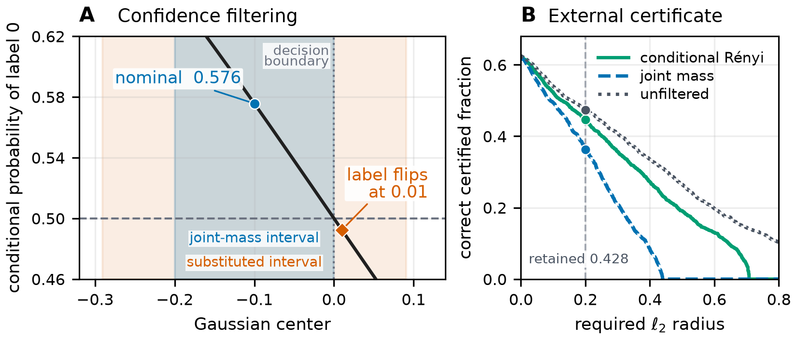

# The Geometry of Randomized Smoothing on Feasible Sets

Code and retained results for the paper. The repository implements certificates for Gaussian smoothing when a fixed feasibility or confidence rule discards some noisy proposals.

Ordinary smoothing controls the Gaussian probability of a label event. After filtering, the reported label probability is the event mass divided by the probability of retention. That denominator changes with the Gaussian center. The code provides a certificate based on joint retention-and-label counts and a conditional certificate for filters with a proved covariance bound.

<p align="center"></p>

## Start here

| Looking for | Location |
| --- | --- |
| Installation, full reproduction commands, dependencies, and external data | [Reproduction guide](docs/REPRODUCING.md) |
| Joint-mass certificate for the unchanged filtered predictor | [`filtered_certificate.py`](src/feasible_robustness/filtered_certificate.py) |
| Conditional covariance and Rényi certificate | [`conditional_renyi.py`](src/feasible_robustness/conditional_renyi.py) |
| Outward binomial and radius calculations | [`validated_numerics.py`](src/feasible_robustness/validated_numerics.py) |
| Finite-horizon trajectory comparison | [`trajectory_certificate.py`](src/feasible_robustness/trajectory_certificate.py) |
| Exact nonconvex witness | [`certify_local_lshape_witness.py`](experiments/certify_local_lshape_witness.py) |
| Reanalysis of the retained CIFAR-10.2 counts | [`reanalyze_cifar102.py`](scripts/reanalyze_cifar102.py) |
| Recorded study protocols and results | [`research/`](research/) and [`outputs/`](outputs/) |
| Retained controller checkpoints | [`controllers/`](controllers/) |
| File integrity checks | [`MANIFEST.sha256`](MANIFEST.sha256) |

## What the figures show



The left panel locates a decision boundary inside the radius obtained by substituting conditional votes. The right panel compares valid certificates on a separate projected-band filter. The released-model evaluation and fresh endpoint tests are shown in [the second figure](docs/figures/auditvotes_recertification.png). A [supplementary comparison](docs/figures/conditional_renyi_reanalysis.png) separates the conditional Rényi, reverse-KL, forward-KL, joint-mass, and unfiltered calculations.

## Reported evaluations

The projected-band study evaluates all 2,000 CIFAR-10.2 test images with one checkpoint, one noise scale, and a filter selected on training data. The following counts are correctly classified images certified at radius 0.2.

| Certificate | Correctly certified images |
| --- | ---: |
| Conditional Rényi for the filtered predictor | 892 |
| Joint mass for the same filtered predictor | 725 |
| Unfiltered Gaussian smoothing | 948 |

The Rényi calculation reuses stored counts. The outward-arithmetic run checks the count-to-radius calculations and leaves these counts unchanged. The unfiltered predictor certifies more images in this evaluation. The separate released-model study confirms 12 label changes inside substituted conditional radii among 128 images selected without model output. This is the yield of that fixed search procedure, not an estimate of population prevalence.

## Verify locally

Use Python 3.11 or newer from the repository root.

```sh
python3 -m venv .venv
. .venv/bin/activate
python -m pip install -e '.[dev,validated]'
python scripts/prepare_recorded_paths.py
PYTHONPATH=.:src python -m pytest -q
shasum -a 256 -c MANIFEST.sha256
```

The verified supplement returned **248 passed, 1 skipped**. The documented skip concerns an original controller configuration containing a machine path. Most mathematical and count-level checks run without a dataset or neural checkpoint.
The setup command creates local compatibility links for paths stored in the original protocols. The links are not part of the repository or file manifest.

To regenerate the exact witness and the two CIFAR-10.2 analyses from retained rows, write new results to a separate directory.

```sh
mkdir -p reproduced
PYTHONPATH=.:src python experiments/certify_local_lshape_witness.py \
  --output reproduced/local_lshape.json
PYTHONPATH=.:src python scripts/reanalyze_cifar102.py \
  --output-directory reproduced/renyi
PYTHONPATH=.:src python scripts/validate_cifar102_certificates.py \
  --output-directory reproduced/validated
```

Rerunning the image model or learned controllers requires the external software and data listed in the [reproduction guide](docs/REPRODUCING.md). The AuditVotes source and checkpoint and the CIFAR datasets are not redistributed here.

The repository currently has no license. Its contents can be inspected and reproduced; permissions for other uses have not been specified.
